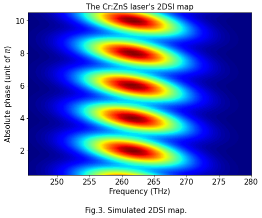

# 2DSI_algorithm
This repository is containing the files of my Jupyter Notebooks, which are describing the principle of the phase retrieval algorithm of <a href="https://opg.optica.org/ol/abstract.cfm?uri=ol-31-13-2063">Two-dimensional spectral shearing interferometry </a> (2DSI). The example given will be about the phase reconstruction of a mid-IR pulses.

Please feel free to read my paper concerning this work <a href="https://opg.optica.org/ao/abstract.cfm?uri=ao-61-4-1076">here</a>.
## Table of Contents
* [General Info](#general-information)
* [Files](#technologies-used)
* [Screenshots](#screenshots)
* [Usage](#usage)
* [Project Status](#project-status)
* [Room for Improvement](#room-for-improvement)
* [Acknowledgements](#acknowledgements)
* [Contact](#contact)
<!-- * [License](#license) -->

## General Information
The measurement of ultrashort laser pulses is highly complex because of their short temporal duration in the range of femtoseconds ( $1$ fs = $10^{-15}$ s). 2DSI is a optical technique, which allows the direct measurement of the laser pulses.
The purpose of this project is to illustrate the working principle of the method in my Masters thesis and help fellow students or researchers understand it.

## Files
* 2DSI_Map_Creator.ipynb
    * A full dataset out of a laser pulse is created and its corresponding 2DSI map is computationally calculated.
* Group_Delay_Extraction.ipynb
    * By using 1-D fast Fourier transforms, the relevant information gets extracted of a 2DSI map.
* Group_Delay_Integration.ipynb
    * A finite difference inversion calculates the spectral phase.
* Pulse_Displayer.ipynb
    * Display and comparsion of the results in the spectral and temporal domain.

## Screenshots

## Usage
Be aware that there might be some bugs in the code. Especially when changing the parameters.

## Project Status
Project is: No longer being worked on.

I've made this repository to demonstrate the principle of the phase retrieval algorithm in my Masters thesis.

## Room for Improvement
Room for improvement:
- Improve flexibility towards new parameters (e.g., center wavelength, spectral width, etc.)
- Implement a pulseTransformer function that is more flexible to changes

## Acknowledgements
- This work was made in no relation with any company or institution but only for personal interests!
- Many thanks to Professor Dr. Satoshi Ashihara who gave me the opportunity to work on the characterization of mid-IR laser pulses. His laboratory's website can be accessed <a href="http://www.ashihara.iis.u-tokyo.ac.jp/wordpress/">here</a>.

## Contact
Created by [@tobiaskugel](https://www.tobiaskugel.com/) - feel free to contact me!